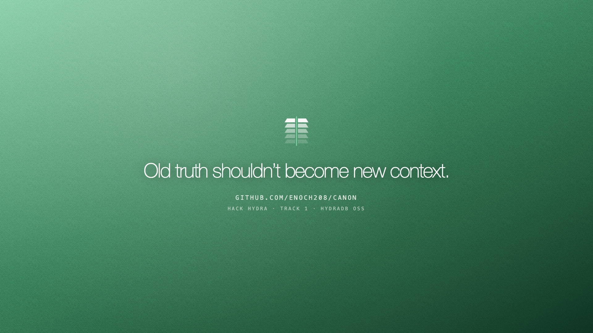
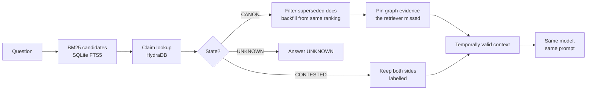

<div align="center">



&nbsp;

<a href="https://x.com/dreyethh/status/2090558437264375887"> Thread</a>

[](https://github.com/Enoch208/canon/actions/workflows/verify.yml)
[](LICENSE)


### Canon performs a Temporal Cut: BM25 decides what is relevant, HydraDB decides what is still allowed to ground the answer.

Most RAG failures are retrieval failures. The one that actually poisons enterprise AI is subtler:
a superseded claim is still **semantically relevant**, so it keeps getting retrieved and quoted as
if it were current. Canon inserts a claim-history graph in **HydraDB OSS** between retrieval and
generation, so evidence that has been explicitly superseded stops reaching the model as
present-tense context — while staying fully answerable as history.

**[ Thread ↗ ](https://x.com/dreyethh/status/2090558437264375887)** &nbsp;·&nbsp; **[ Judge it in 90 seconds ↗ ](#judge-canon-in-90-seconds)** &nbsp;·&nbsp; **[ The numbers ↗ ](#the-numbers)** &nbsp;·&nbsp; **[ How HydraDB decides ↗ ](#how-i-integrated-hydradb)**

</div>

---

## ▶ Demo

https://github.com/user-attachments/assets/fccf8d5f-eb14-4e97-bd56-7aea6e5377c6

Every frame is the real console driving the real graph — no mockups, no after-effects screens. It
walks one benchmark conflict end to end: a Confluence page still publishing retired pricing, the
document that explicitly supersedes it, the canon event HydraDB records between them, a live *Ask*
answering `30%` in current mode and `20%` in historical mode with the superseded document visibly
filtered, the Temporal Cut removing that document from a ranking and backfilling the next
candidate, and `make verify` passing seven live checks with a database restart in the middle.

```
Same model. Same prompt. Same corpus. Same context budget.
Only the context topology changes.
```

---

## Judge Canon in 90 seconds

**Live console: [canon-bay.vercel.app](https://canon-bay.vercel.app)** — frontend on Vercel,
and behind it a dedicated server running the real thing: HydraDB OSS against its S3 backend, the
FastAPI service, and the full 511,958-document corpus indexed on that machine from the published
dataset. No snapshot, no cached analytics — every answer on the live site is a live HydraDB
traversal, and the graph going down takes the answers with it. Everything also runs locally in
four commands.

Four numbers, all reproducible from this repository:

| | |
|---|---|
| **14/20 → 1/20** | superseded gold documents reaching present-tense context (deterministic, no model) |
| **70.0% → 82.5%** | correctness on the benchmark's own scorer — with **no answer hint in the prompt**, while random removal of the same number of documents scores exactly the baseline 70.0% |
| **471/480 · 0 harmed** | across all 500 benchmark questions, non-conflict contexts stay byte-identical except nine interventions that each trace to a proven supersession chain — and no expected document is ever removed outside the conflicts |
| **20/20** | unanswerable questions answered `UNKNOWN`; historical questions recover the retired evidence 20/20 |

```bash
make hydra-up && uv sync
make verify        # 7 live checks incl. a HydraDB restart mid-suite — all PASS
make api && pnpm --dir apps/web dev
open http://localhost:3000/cut    # the Temporal Cut, on one real conflict, live
```

`/cut` shows the same BM25 ranking twice: on the right, HydraDB removes the document that still
asserts the retired value, backfills the next candidate from the same ranking, and the baseline's
wrong answer sits next to Canon's correct one — same model, same prompt, same context budget.
Every number above is fingerprinted in `evidence/run_manifest.json` (git commit, HydraDB image
digest, dataset revision, SHA-256 of every result file).

---

## Table of contents

- [The problem I set out to solve](#the-problem-i-set-out-to-solve)
- [What I built](#what-i-built)
- [Architecture](#architecture)
- [The resolution loop, step by step](#the-resolution-loop-step-by-step)
- [How I integrated HydraDB](#how-i-integrated-hydradb)
- [Engineering decisions & the hard problems](#engineering-decisions--the-hard-problems)
- [The numbers](#the-numbers)
- [Use it as a component](#use-it-as-a-component)
- [Identity resolution](#identity-resolution)
- [The live console](#the-live-console)
- [Honesty: limitations](#honesty-limitations)
- [Tech stack](#tech-stack)
- [Project layout](#project-layout)
- [Run it locally](#run-it-locally)
- [Tests](#tests)
- [Attribution](#attribution)

---

## The problem I set out to solve

Enterprise knowledge is not a bag of facts — it is a collection of **time-bound assertions**. A
launch date is correct on Monday, superseded on Wednesday, historically valid on Friday, and
dangerous if retrieved as current context a month later.

Traditional retrieval optimizes for relevance, which creates a temporal failure mode: **the most
semantically relevant evidence may no longer be the correct evidence.** In EnterpriseRAG-Bench's
official conflict questions, plain BM25 puts the superseded gold document into the present-tense
context in **14 of 20 cases** — and it usually ranks *above* other candidates, because the retired
claim was written by the same people, about the same system, in the same words.

So I treated *"this document used to be true"* as a first-class state, sitting right next to
relevance. Every design decision below exists to make retired truth **visible as history and
unreachable as present**.

## What I built

A pipeline where the graph decides what the model is allowed to read:

1. **Index** — all 511,958 unique benchmark documents into SQLite FTS5. Cheap retrieval globally.
2. **Extract** — the 20 official conflict claim neighborhoods, deeply: exact evidence spans,
   structured-field detection, stance markers, plus a corpus-wide residue scan per retired value.
   Deep reasoning locally.
3. **Canonize** — resolve which value is current, in a fixed priority order where **explicit
   supersession language beats majority vote**. Eight documents repeating the old price lose to one
   later document that says the price changed.
4. **Temporal Cut** — at question time, walk retrieved candidates back to their claims in HydraDB, label
   every document (`current_evidence`, `superseded_for_current_grounding`, `historical_evidence`,
   `contested_evidence`, `not_in_claim_graph`), replace superseded documents with the next
   candidates from the same ranking, and pin graph evidence the retriever missed.
5. **Answer** — the same model, prompt and context budget as the baseline: every arm answers from
   exactly 10 documents. Only the context topology differs — that is the whole ablation.
6. **Prove** — every decision carries the supersession chain, exact spans, temporal quality
   (`T1`/`T2`/`T3`) and the actual HydraDB queries with timings, returned as a **Temporal Context
   Receipt**: the ranking that went in, the cut set with the reason for each cut, the context that
   went out, a hash of it, and the query ids that decided it.

Every current-state answer is exactly one of **`CANON`**, **`CONTESTED`**, **`UNKNOWN`**. Where the
evidence does not establish a winner, Canon shows the fork instead of inventing one — the 20
official `info_not_found` questions resolve to `UNKNOWN` 20/20, and one conflict stays `CONTESTED`
because neither timestamps nor language order it.

## Architecture



The graph distinguishes a mention from a truth:

```
Entity ──HAS_CLAIM──▶ ClaimKey ──HAS_VALUE──▶ Proposition ◀──ASSERTS── Assertion ──IN_ARTIFACT──▶ Artifact
                                                   ▲
                                                   │ SELECTS
                                              CanonEvent ──SUPERSEDES──▶ CanonEvent
```

| Object | Role |
|---|---|
| `Entity` | A real-world thing. |
| `ClaimKey` | One mutable property of it — `(Hosted enterprise_playbook, monthly_token_volume_discount_breakpoints)`. |
| `Proposition` | One possible value. Ten artifacts asserting it still make **one** proposition node. |
| `Assertion` | One artifact asserting that value — exact span, stance, source field, structured-or-prose, discovery (`conflict_pair` vs `corpus_scan`). |
| `CanonEvent` | The event that selects a value as current and may `SUPERSEDES` a prior event. History is never overwritten. |

Document text lives in SQLite FTS5. The truth topology — what supersedes what, and which evidence
may ground a present-tense answer — lives entirely in HydraDB, which runs against an S3-compatible
object store (MinIO in `docker-compose.yml`) because its writer-lease and manifest paths need
conditional writes a plain local filesystem does not implement.

## The resolution loop, step by step

Canonization runs in a fixed priority order, and the order is load-bearing:

1. **Explicit supersession** — `"moved from X to Y"`, `"old doc says X — that's outdated"`. The
   strongest signal, and the only one allowed to beat corroboration.
2. **Reliable temporal ordering** — only at `T1`, where metadata and semantics agree.
3. **Corroboration** — a tie-break only. **Majority vote never overrides proven supersession** —
   this is enforced by a unit test (8 artifacts at `$0.08` vs one explicit update to `$0.06` must
   resolve to `$0.06`) and re-proven live on every `make verify`.
4. **No signal** — `CONTESTED` at `T3`. Never manufacture an ordering.

At question time, `ground()` maps the question to a claim by lexical overlap (measured: 20/20
conflict questions hit the right claim, 0/20 `info_not_found` questions hit any claim), resolves it
through the graph, labels every retrieved document, filters-and-backfills, and returns the state,
the evidence, and the query cards.

## How I integrated HydraDB

HydraDB OSS speaks an OpenCypher subset over HTTP. I probed the subset empirically before building
on it, and three traversals decide every answer:

| Operation | Cypher |
| --- | --- |
| Claim neighborhood | `MATCH (c:ClaimKey {id: $id})-[:HAS_VALUE]->(p:Proposition) RETURN p.value, p.status` |
| Supersession lineage | `MATCH (ev:CanonEvent {id: $id})-[:SUPERSEDES*1..10]->(old)-[:SELECTS]->(p) RETURN p.value` |
| Residue reverse traversal | `MATCH (p:Proposition {id: $id})<-[:ASSERTS]-(a:Assertion)-[:IN_ARTIFACT]->(d:Artifact) RETURN a.evidence_span, d.doc_id` |

Removing HydraDB removes the answer, not a visualization: the retired/current split, the ordering
and the filtering all come out of those traversals. Integration facts I learned the hard way and
built around:

- **Write idempotency keys derive from the request's `query_id`** — and the server's default
  counter restarts at 1 on every process restart, so post-restart writes silently deduplicate
  against results stored by an earlier process. My client sends a globally unique `query_id` on
  every request; `make verify` restarts the database mid-suite to prove writes survive it.
- **`MERGE` doesn't exist and `MATCH` on an unknown id returns a phantom row of nulls** — so the
  writer is idempotent by checking a real property (`n.kind`) before every create, and re-ingest
  creates exactly 0 new nodes.
- **Unanchored edge scans exceed the 30 s query timeout** once a benchmark subgraph is loaded —
  every product query starts from a vertex id or a namespace predicate, and graph statistics are
  measured once into `evidence/graph_stats.json` instead of being counted per request.
- **Deletes are asymmetric** — edges tear down at thousands per second, vertices at ~1/s, so the
  perf harness deletes edges first and records what it leaves.

`make perf` loads a labelled 10,011-vertex / 29,760-edge subgraph and measures the traversals Canon
actually depends on (`evidence/hydra_perf.json`):

| Measurement | Value |
| --- | --- |
| Write throughput | 5,119 edges/s |
| Reverse traversal (fan-in 41) | p50 2.2 ms / p95 2.9 ms |
| Variable-depth lineage (`SUPERSEDES*1..10`) | p50 3.3 ms / p95 4.5 ms |
| Two-hop neighborhood (123 rows) | p50 15.0 ms / p95 17.7 ms |
| Edge teardown | 3,174 edges/s |

## Engineering decisions & the hard problems

- **Structured-state-or-nothing.** The graph returns states and typed records, never prose. That
  single decision is what makes an honest `UNKNOWN` possible — and it is why 20/20 unanswerable
  questions come back `UNKNOWN` instead of plausible hallucinations.
- **The three-arm ablation is the real differentiator.** Canon's context used to carry a one-line
  note stating the graph's conclusion — an obvious objection: *"you told the model the answer."*
  So I added `canon_filtered`: identical filtered context, **no note**. It carries most of the gain
  on the official scorer, which turns the objection into the headline.
- **Document-count parity.** Early runs quietly handed Canon fewer documents than the baseline
  (dropped superseded docs left empty slots), which depressed its completeness scores. Every arm
  now sees the same number of documents — Canon backfills from the same BM25 ranking, never from
  anywhere else, and never re-admits a superseded document. The last hole in this closed late: when
  the graph pinned a current document BM25 had missed, that pin used to create an eleventh slot on
  two questions (202 vs 200 documents). It now evicts the lowest-ranked candidate instead, so the
  parity is exact — 200 / 200 / 200 — and the headline numbers were re-measured after the fix
  rather than assumed to hold.
- **The judge-failure catch I'm most glad I made.** The official evaluator scored one arm at 7.5%
  correctness — while judging visibly correct answers wrong with *empty reasoning fields*. At
  `--parallelism 6` the judge's own API calls were being rate-limited, and the harness reports a
  failed judge call as `correct=False` rather than as an error. 36 of 40 verdicts were empty. At
  parallelism 2 the same answers score 77.5%. I nearly published a catastrophically wrong number
  that was really an infrastructure artifact.
- **The 1024-row truncation catch.** Person and Alias counts both read exactly 1,024 — suspicious
  in the way only powers of two are. The count was implemented by counting returned rows, and the
  server caps result sets at 1024. Real values: 35,703 Person and 4,193 Alias nodes materialised
  in HydraDB — the stratified sample of the corpus-wide identity index, whose full totals live in
  the Identity resolution section below. Every count in the product now uses a server-side
  `count(*)`.
- **Paid work is never lost.** The benchmark runner validates its output path *before* spending on
  API calls, records `answers_completed` and the verbatim error when a provider dies mid-run, and
  a `--limit` smoke run writes to `partial.json` — it can never overwrite the headline results.
- **Hermetic quality gate.** 56 unit tests run in under a second with no database and no network;
  15 integration tests are marked `hydra` and skip with a reason when the graph is unreachable. CI
  boots the real HydraDB OSS image against MinIO and runs them for real.

## The numbers

Dataset: [`onyx-dot-app/EnterpriseRAG-Bench`](https://huggingface.co/datasets/onyx-dot-app/EnterpriseRAG-Bench) —
all 20 official `conflicting_info` questions and all 20 official `info_not_found` questions.
Baseline and Canon share the same corpus, the same BM25 candidate retrieval, the same `top_k = 10`,
and exactly the same context budget: every arm answers every question from exactly 10 documents.
When the graph removes a superseded document, the next candidate from the same ranking backfills
the slot; when it pins a current document BM25 missed, the lowest-ranked candidate is evicted to
make room. The context never grows and never shrinks — only its composition changes.

### Deterministic (no model in the loop)

| Metric | BM25 baseline | Canon |
| --- | --- | --- |
| Superseded document in present-tense context | 14 / 20 | **1 / 20** |
| Current gold document in context | 18 / 20 | **20 / 20** |
| Historical question recovers the retired evidence | — | **20 / 20** |
| `info_not_found` resolves to `UNKNOWN` | — | **20 / 20** |

The one remaining case is the contested claim — no supersession is established, so nothing is
dropped. That is correct behavior, not a miss.

### Official benchmark scorer

Scored by the benchmark's own evaluator
([`metrics_based_eval`](https://github.com/onyx-dot-app/EnterpriseRAG-Bench), `--no-correction`,
judge `claude-sonnet-4-6`) — their harness, their judge, their gold answers:

| Metric | baseline | random filter | canon_filtered *(no note)* | canon |
| --- | --- | --- | --- | --- |
| **Correctness** | 70.0% | 70.0% | **82.5%** | 77.5% |
| Completeness | 69.8% | 72.1% | 69.9% | **77.9%** |
| Combined (corr × comp) | 56.84 | 56.26 | **65.82** | 59.85 |
| Document recall | 80.0% | 72.5% | 52.5% | 52.5% |

**The no-note arm is Canon's production behavior** — `/v1/ground` returns evidence and proof,
never an answer hint, so `canon_filtered` is the configuration the product ships and the note arm
is kept as an ablation. Nothing tells the model which value is current —
and it still moves correctness from 70.0% to 82.5%. Context topology alone does the work. Document
recall falls by construction: the harness counts *both* conflicting gold documents as expected, and
Canon removes the superseded one on purpose. That trade — recall for correctness — is the product.

### Answer-level, three full runs

Same answering model (`claude-sonnet-5`), same prompt, graded against each question's official
`answer_facts` (three judge passes, majority verdict — these rows are model-judged). Mean with
observed range across three end-to-end runs:

| Metric | baseline | canon_filtered | canon |
| --- | --- | --- | --- |
| Answer states the current value | 14.7 / 20 *(14–15)* | 17.7 / 20 *(17–18)* | **19 / 20 *(19–19)*** |
| Answer presents the retired value as current | 1.3 / 20 | 0.7 / 20 | **0.3 / 20** |
| Context documents | 200 | 200 | 200 |

Canon returned 19/20 in **all three runs with zero variance**; both other arms moved between runs.
Per-run files are in `eval/results/runs/`, the aggregate in `eval/results/summary.json`, and
`make export-answers` writes the official-format JSONL so anyone can re-score without trusting this
repository.

### The causal controls

Two cheap attacks on our own result, both run:

**Random filtering does not reproduce the effect.** A control arm removes the *same number* of
documents Canon removes per question — chosen uniformly at random (seeded per question) — and
backfills from the same ranking. Random removal hit the superseded document in only **1 of 20**
conflicts, leaving it in context **13/20** versus Canon's **1/20** (`evidence/random_control.json`).
On the official scorer the random arm lands at **70.0% — exactly the baseline** (0 judge failures,
`eval/official/results-random_filter.json`). Cutting the same number of documents buys nothing;
the entire +12.5 points comes from cutting the *right* one, and knowing which one is right is what
the graph is for.

**The effect is stable across retrieval depth.** Sweeping `top_k` (`evidence/topk_sweep.json`):

| top_k | superseded in context — baseline | — Canon | current gold — Canon |
|---|---|---|---|
| 5 | 13/20 | **1/20** | 20/20 |
| 10 | 14/20 | **1/20** | 20/20 |
| 20 | 15/20 | **1/20** | 20/20 |

The wider the retrieval, the more retired truth leaks into the baseline. Canon stays at 1 — the
contested claim, where dropping anything would be wrong.

**Which half of the cut does the work?** The Temporal Cut does two things: it removes documents
proven superseded, and it pins current evidence the retriever missed. Running each half alone,
same 20 questions and same 10-document budget (`make mechanism` → `evidence/mechanism.json`):

| Arm | superseded doc in context | current gold in context | context docs |
|---|---|---|---|
| Baseline | 14/20 | 18/20 | 200 |
| Cut only | **1/20** | 18/20 | 200 |
| Pin only | 14/20 | **20/20** | 200 |
| Full Temporal Cut | **1/20** | **20/20** | 200 |

The two halves are cleanly separable: suppression is what stops retired evidence reaching the
model, pinning is what recovers the current evidence BM25 ranked out. Only both together give a
context that is simultaneously clean and complete. *(These rows are deterministic — no model. The
answer-level scores for the two half-arms are generated but not judged: the API key ran out of
credit mid-judging, and a failed judge call is recorded by the harness as an incorrect answer, so
publishing those percentages would be publishing an infrastructure artifact. `evidence/mechanism.json`
records this as `not_run`.)*

**The effect is not model-specific.** The same 20 conflict questions, same contexts, answered by
a much weaker model (`claude-haiku-4-5`) and scored by the same official harness: baseline
**75.0%** → Temporal Cut **80.0%** (`evidence/second_model.json`). A stronger model and a weaker
model both improve when the graph fixes the evidence, because the intervention never depended on
the model — it fixes what the model is allowed to read.

### The safety envelope: all 500 questions

A grounding layer that helps on 20 questions and silently corrupts the other 480 would be
unshippable. So the deterministic grounding layer runs over **every question in the benchmark** —
no model, no sampling (`make envelope` → `evidence/safety_envelope.json`):

| Across all 500 benchmark questions | |
| --- | --- |
| Non-conflict contexts left byte-identical | **471 / 480** |
| Expected documents removed outside the conflicts | **0** |
| Documents removed outside the conflicts | 1 |
| Current-evidence documents pinned outside the conflicts | 8 |

Every one of the nine interventions outside the conflict set traces to a proven supersession
chain, and the evidence file names each one. Eight pin the *current* gold document of a known
conflict into a topically adjacent question. The single removed document is the *retired* gold of
`qst_0419` — retired truth leaking into a neighboring question's retrieval, cut for exactly the
reason it is cut everywhere else. **Canon is fail-narrow: it changes retrieval only where HydraDB
can prove supersession, and it never removed an expected document from any question outside the
conflicts.**

### Data, stated exactly

- **Indexed:** 511,958 of 511,962 documents (4 duplicate `doc_id`s) in 177 s → `evidence/corpus_index.json`.
- **Deeply extracted:** the 20 conflict claim neighborhoods — 39 gold documents plus a corpus-wide
  residue scan per retired value → `evidence/seed.json`. Nothing else was claim-extracted, and
  nothing else is claimed.

## Use it as a component

Canon is not only a console — it exposes one clean contract. Put it between your retriever and
your LLM:

```bash
curl -X POST localhost:8000/v1/ground -H 'Content-Type: application/json' -d '{
  "question": "What monthly token volume discount breakpoints apply for Hosted pricing?",
  "mode": "current"
}'
# → a Temporal Context Receipt:
# { "state": "CANON", "answer_value": "250k / 2M / 10M",
#   "input_ranking": [10 doc ids as BM25 returned them],
#   "cut": [{ "doc_id", "claim_key", "transition", "temporal_quality", "evidence_span" }],
#   "current_evidence": [...], "suppressed_evidence": [...], "backfill_evidence": [...],
#   "final_context": [...], "context_sha256": "…",
#   "hydra_query_ids": [...], "proof": [17 HydraDB query cards] }
```

Every grounding decision ships as **proof-carrying context**: the ranking that came in, the exact
cut set with the supersession that justifies each cut, the context that went out, a hash of it,
and the HydraDB query ids that decided it. An auditor can replay the decision without trusting
the service.

**It fails closed.** If HydraDB is unreachable, `/v1/ground` returns `503
TEMPORAL_GRAPH_UNAVAILABLE` instead of silently degrading to plain retrieval — turn the graph off
and Canon *loses the ability* to decide current context, which is the point.

## Identity resolution

Track 1 is an ontology track, so identity has to be real rather than asserted. Canon resolves
people from explicit `Name <email>` bindings that appear verbatim in the corpus — no model
judgment, no invented edges:

```
121,390 gmail documents scanned · 1,933,236 bindings · 177,377 people · 251,498 aliases   (48 s)
RESOLVED 182,249 · PROBABLE 48,190 · AMBIGUOUS 21,059
```

| State | Meaning |
|---|---|
| `RESOLVED` | An email bound to exactly one person by an explicit `Name <email>` line |
| `PROBABLE` | A name spelling or email local part mapping to exactly one person, inferred from bindings |
| `AMBIGUOUS` | The alias maps to several people — kept as a visible fork, **never merged** |

`Grace O'Connor`, `Grace Oconnor` and `AM Grace O'Connor` collapse onto one person. `Alyssa Chen`
exists at three different companies, so that alias stays ambiguous — the graph shows the fork
instead of guessing. Two scales, labelled exactly: the numbers above are the **corpus-wide
identity index** built by the deterministic scan (177,377 people / 251,498 aliases, held in the
lexical store); a **stratified sample of 35,703 Person and 4,193 Alias nodes** is materialised as
real HydraDB vertices for graph traversal. `evidence/entities.json` records both.

## The live console

Hosted at **[canon-bay.vercel.app](https://canon-bay.vercel.app)**, backed by a dedicated server
running HydraDB OSS and the full corpus — every page is a live traversal, not a cached snapshot.
The app leads with a truth dashboard, not a chat box; every number on it is a graph query, and
zeros are shown as zeros.

| Page | What it shows |
|---|---|
| `/` | The landing page, built from live API data — real evidence spans in the hero |
| `/truth` | 20 claim keys: 19 canon transitions, 1 contested, filtering and recovery counts |
| `/change/[id]` | One truth change: retired vs current values, exact spans, residue, canon events, and the HydraDB query cards with timings |
| `/ask` | Ask in current or historical mode → state, value, why, evidence, retired context filtered, query cards |
| `/residue` | Where retired values still survive in the corpus, by class, every row inspectable |
| `/entities` | Alias → person resolution with the binding that proves each edge |
| `/cut` | The Temporal Cut on one real conflict: the same ranking twice, the retired sentence, the graph path that justifies the cut, and both answers side by side |
| `/results` | The full benchmark: the 500-question safety envelope, deterministic rows, official harness scores, four-arm answers |

## Honesty: limitations

- **Verified structured residue is 0 on this corpus.** No document asserts a retired value inside a
  typed `field: value` line of a structured source; retired values live in prose. The count is
  reported as 0 rather than relaxed. What is reported instead: 8 `LEXICAL_RESTATEMENT`s (retired
  value verbatim, no historical/rejected marker on the line, stance unproven), each inspectable in
  `eval/residue_bench.jsonl`.
- **Verified resurrection is 0.** The dataset has no metadata timestamps, so no reassertion can be
  ordered against a supersession time. Claiming resurrection would require an ordering the data
  does not support.
- **Temporal quality is inherited from the human-inspected conflict inventory**
  (`research/conflict_inventory.json`) — 16 `T1`, 3 `T2`, 1 `T3`. `T2` claims resolve only by
  explicit language, never by timestamp.
- **Answer rows are model-judged; everything else is deterministic** and labelled as such. A
  deterministic string match was tried and rejected — it cannot tell `short: <128` from
  `short <128`. No headline residue or graph number depends on model judgment.
- **Question→claim matching is lexical** (3+ shared terms, half the claim key's terms). Measured:
  20/20 conflicts resolve correctly, 0/20 unanswerables match anything; a looser rule falsely
  matched 4. Embedding-based matching would scale better and is not implemented.
- **The mechanism decomposition is published deterministic-only.** Answers for the cut-only and
  pin-only arms are generated and saved, but the official harness scoring is recorded as `not_run`
  in `evidence/mechanism.json`: the API key ran out of credit mid-judging, and the harness records
  a failed judge call as an incorrect answer, so those percentages would be an infrastructure
  artifact rather than a measurement. The deterministic rows need no model and stand on their own.
- **Identity links people, not claim authorship.** Aliases come from real bindings; the entities
  owning ClaimKeys are normalised from the claim key itself. Only 2 of 20 conflict gold documents
  contain a `Name <email>` binding, so wiring authors to claims honestly was out of reach on this
  corpus.
- Candidate retrieval is lexical BM25. Semantic retrieval would change recall, not the temporal
  argument.

## Tech stack

- **Backend:** Python 3.12, `uv` workspace (one package per responsibility, downward-only imports),
  Pydantic v2, FastAPI, SQLite FTS5, `pytest`, `ruff`.
- **Graph:** HydraDB OSS over HTTP (OpenCypher subset), MinIO as the S3-compatible store, via
  `docker compose`.
- **Frontend:** Next.js 16, React 19, Tailwind CSS v4, Hugeicons.
- **Models:** `claude-sonnet-5` / `claude-haiku-4-5` via the Anthropic API behind a single
  interface; any non-`claude-*` model id routes to an OpenAI-compatible local endpoint instead.

## Project layout

```
packages/
  graph/        canon_graph — HydraDB client, schema, ids, canonize, ingest, resolve, grounding, verify, perf
  retrieval/    canon_retrieval — SQLite FTS5 corpus store + BM25 candidate retrieval
  extraction/   canon_extraction — values, structured parsing, conflicts, residue sweep, identity, seed pipeline
  evaluation/   canon_evaluation — answering boundary, context builder, metrics, arm runner, safety envelope, judging
services/api/   canon_api — FastAPI over the packages, with cached expensive endpoints
apps/web/       Next.js console — landing, truth dashboard, change, ask, residue, identities, results
scripts/        thin CLIs: index, seed, entities, graph-stats, benchmark, judge, aggregate, export,
                perf, verify, plus the controls — topk_sweep, random_control, mechanism,
                safety_envelope, second_model, run_manifest
eval/           official question ids, results (latest + three runs + aggregate), official-format
                exports and the per-question judge outputs for every arm
evidence/       verify, perf, index, seed, identity, official-eval, topk sweep, random control,
                mechanism, safety envelope, second model, run manifest — everything a claim rests on
research/       conflict_inventory.json — the human-inspected 20 conflict pairs
```

## Run it locally

**Prerequisites:** Docker, `uv`, Node 20+, `pnpm`.

```bash
make hydra-up      # MinIO + HydraDB OSS: :8443 HTTP, :7687 Bolt, :9090 metrics
uv sync
make verify        # 7 live checks, incl. a database restart mid-suite
make index         # SQLite FTS5 over the benchmark parquet (~3 min, ~4 GB)
make seed          # extract the 20 conflict claims + residue scan into HydraDB
make entities      # resolve people and aliases from the corpus into HydraDB
make graph-stats   # record real node/edge counts into evidence/
make benchmark     # three-arm run → eval/results/latest.json
make judge         # grade saved answers against the dataset rubric
make envelope      # deterministic sweep over all 500 questions → evidence/safety_envelope.json
make mechanism     # cut-only vs pin-only decomposition → evidence/mechanism.json
make manifest      # fingerprint every artifact a claim rests on → evidence/run_manifest.json
make api           # FastAPI on :8000
pnpm --dir apps/web dev   # console on :3000 — landing at /, Temporal Cut at /cut
```

`make verify` prints:

```
HydraDB write/read ...... PASS
Persistence ............. PASS
Supersession ............ PASS
Majority adversarial .... PASS
Residue traversal ....... PASS
UNKNOWN ................. PASS
CONTESTED ............... PASS
```

The majority-adversarial check is the load-bearing one: 8 artifacts asserting `$0.08` against a
single later document saying the price changed to `$0.06`. Canon must return `$0.06` — majority
vote never overrides proven supersession.

Environment: copy `.env.example` to `.env`. Only `ANTHROPIC_API_KEY` costs anything, and only the
answer arm and judging use it — everything else runs with no key, and any step missing a dependency
is recorded as `not_run`, never simulated.

## Tests

```bash
uv run pytest -m "not hydra"   # 56 unit tests, no network, < 1 s
uv run pytest -m hydra         # 15 integration tests against the live graph
```

The suite covers canonization ordering (including the 8-vs-1 adversarial case), id determinism,
structured-field and stance parsing, value variants, residue classification, grounding document
dispositions, metric math, the judge plumbing, partial-run protection, and full write→restart→read
round trips against a real HydraDB. CI boots the actual HydraDB OSS image with MinIO and runs all
of it on every push.

## Attribution

Canon is built on other people's work. Everything below is used under its own licence.

**Database** — [HydraDB OSS](https://github.com/hydra-db/hydradb) (AGPL-3.0), run from the
published `ghcr.io/hydra-db/hydradb` image with MinIO as the S3-compatible backend.

**Datasets** — [EnterpriseRAG-Bench](https://huggingface.co/datasets/onyx-dot-app/EnterpriseRAG-Bench)
by Onyx: 511,962 documents and 500 questions. Documents, questions, gold answers and the
per-question `answer_facts` rubric come from that dataset, unmodified. Its
[repository](https://github.com/onyx-dot-app/EnterpriseRAG-Bench) also publishes the
answer-evaluation harness used for the official scores above.

**Python** — `pyarrow` (Apache-2.0), `huggingface_hub` (Apache-2.0), `fastapi` + `uvicorn`
(MIT/BSD-3), `anthropic` (MIT), `python-dotenv` (BSD-3), `pytest` and `ruff` (MIT). SQLite FTS5
ships with Python.

**Web** — `next` (MIT), `react` (MIT), `tailwindcss` (MIT), `@iconify/react` with the
[Hugeicons](https://hugeicons.com) icon set (MIT).

**Models** — `claude-sonnet-5` and `claude-haiku-4-5` via the Anthropic API for answer generation
and judging; Qwen3 via an OpenAI-compatible local endpoint for offline runs. Every result file
records which model produced it.

No code was copied from another project. The lexical store, claim graph, canonization order,
residue sweep, identity resolution and evaluation harness in this repository are original.

## License

MIT
